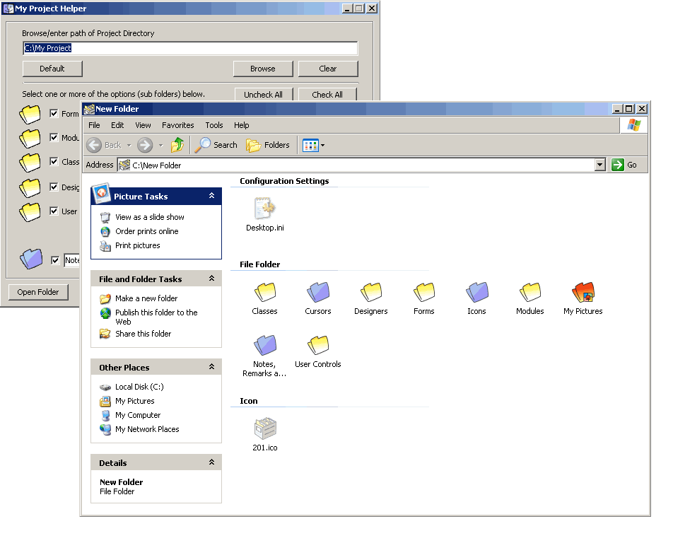

## Custom Project Folders/Directories

### Description

Create your (custom) VB Project Folder quickly. The primary sub directories are listed, so just tick what is required for your project.
 
### More Info
 
New Directory or Folder Name

The code utilized in this tiny project is an ecclectic collection of source code collected over a number of years from various authors and own code. If I have missed crediting the originating authors, please forgive the omission. Enjoy and feel free to alter the code to suit your purpose(s). TC.

             |
---                |---
**Submitted On**   |2007-08-28 12:25:28
**By**             |[Tilden Constable](https://github.com/Planet-Source-Code/PSCIndex/blob/master/ByAuthor/tilden-constable.md)
**Level**          |Intermediate
**User Rating**    |4.7 (28 globes from 6 users)
**Compatibility**  |VB 6\.0
**Category**       |[Complete Applications](https://github.com/Planet-Source-Code/PSCIndex/blob/master/ByCategory/complete-applications__1-27.md)
**World**          |[Visual Basic](https://github.com/Planet-Source-Code/PSCIndex/blob/master/ByWorld/visual-basic.md)
**Archive File**   |[Custom\_Pro2081068292007\.zip](https://github.com/Planet-Source-Code/tilden-constable-custom-project-folders-directories__1-69221/archive/master.zip)

